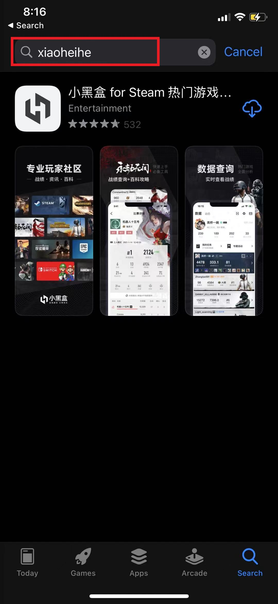
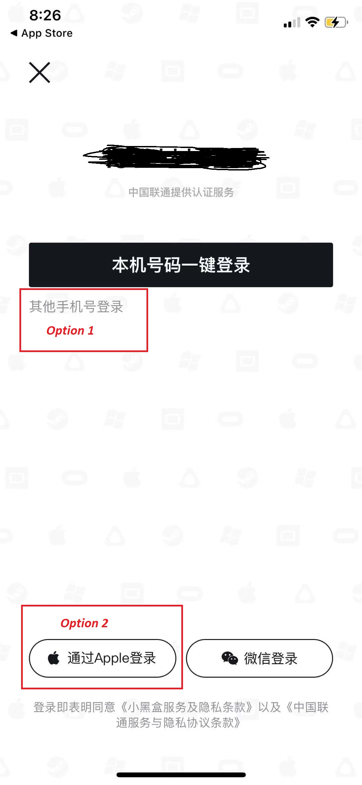
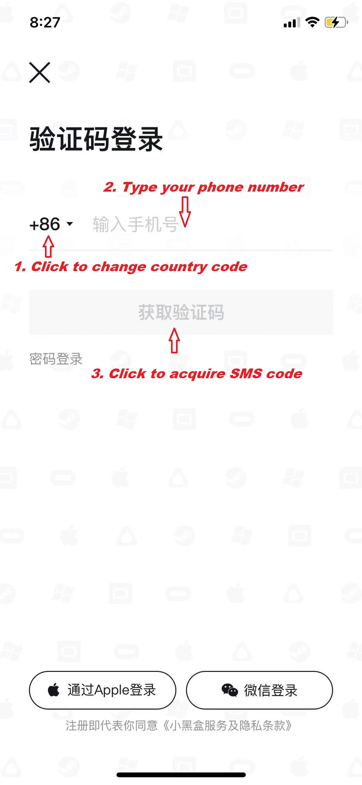

# MAXP
This is a simple guide how to access Max+ without having wechat
# Introduction
MAX+ is a Chinese app which focused on cyber games and game related topics. Recently MAX+ added a feature to trade csgo ingame skin with a competitive convenience fee(1%).
The purpose of this guide is to help non-Chinese users to access p2p trading features on MAX+.
Most of max+ feature is embedded which means you can access it from another app.
Today I am going to show you a magic trick to bypass Max+ with another app(which developed from the same parent company as Max+) to unlock most of its feature.

# IOS User Section
## Download
Instead of downloading Max+ app directly. You need to search for an app called xiaoheihe ->(It is the same company who developed MAX+)
###

###

Why not directly download MAX+ : 
> The MAX+ App currently does not support international mobile number register while xiaoheihe does

## Login
Click the grey syntaxt on your mobile.

###

###

Fill in your mobile number then type your SMS code.

Bingo you have access to MAX+ now.

## Bind Steam

Now you have to go through the same step as you bind your steam to other trading app like buff163/c5/igxe.

## Trading

