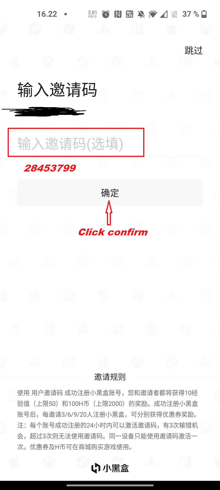

# MAXP
This is a simple guide how to access Max+ without having wechat
# Introduction
MAX+ is a Chinese app which focuses on cyber games and game related topics.   
Recently MAX+ added a feature to trade CSGO ingame skin with a competitive convenience fee(1%).   
The purpose of this guide is to help non-Chinese users to access p2p trading features on MAX+.   
Most of max+ features are embedded which means you can access it from another app.   
Today I am going to show you a magic trick to bypass Max+ with another app(which is developed from the same parent company as Max+) to unlock most of its features.  

## Download
Instead of downloading Max+ app directly. You need to search for an app called [Xiaoheihe](https://www.xiaoheihe.cn/home). 
It is the same company who developed MAX+.
###

###

Why not directly download MAX+ : 
> The MAX+ App currently does not support international mobile number register while xiaoheihe does

## Login
There are two options to login to Xiaoheihe.  
It is recommended to directly use your mobile number. 
Simply click the grey syntax on your mobile. 

Fill in your mobile number then type the SMS code you got.  

###

###

BOOM! You have access to MAX+ now.(Through it's sibling app Xiaoheihe) 

For first time user, you had to go through some additional steps(it won't show up in the future). 

###

You can select random option in the following part. 

###

To access the p2p trade section just follow the step below:
###

###
BOOM! You have access to p2p trade now.

## Bind Steam

Now you have to go through the same step when you bind your steam to other trading app like buff163.

## Trading

## Question
Feel free to send me a DM:  
[My Twitter](https://twitter.com/noblesix_csgo)  
My Discord: squintjet811#6353  

